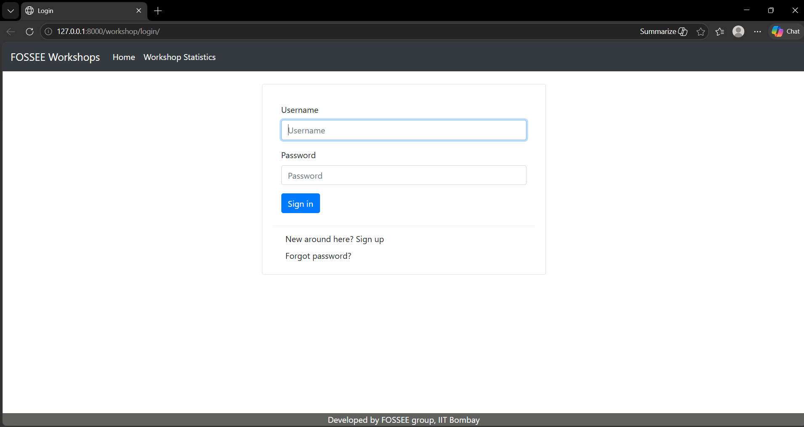
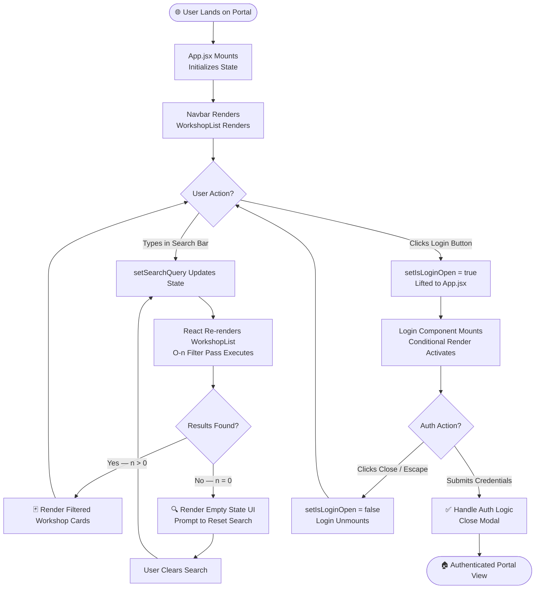

# 🔬 FOSSEE Workshop Portal — Redesign Submission

> **Fellowship Task | FOSSEE, IIT Bombay**
> Submitted by: **[Your Name]** | Reg. No: `23BCE11399` | VIT Bhopal University

---

## 📋 Table of Contents

1. [Project Identity](#-project-identity)
2. [Technical Architecture](#-technical-architecture)
3. [Engineering Decisions](#-engineering-decisions)
4. [Visual Journey — Before & After](#-visual-journey--before--after)
5. [Workflow Visualization](#-workflow-visualization)
6. [Accessibility](#-accessibility)
7. [Setup Instructions](#-setup-instructions)

---

## 🪪 Project Identity

| Field | Detail |
|---|---|
| **Project Title** | FOSSEE Workshop Portal — UI/UX Redesign |
| **Student Name** | Pratik Kolhe |
| **Registration Number** | 23BCE11399 |
| **Institution** | VIT Bhopal University |
| **Program** | B.Tech — Computer Science Engineering |
| **Fellowship** | FOSSEE Fellowship — IIT Bombay |
| **Task Type** | Portal Redesign Task |
| **Primary Stack** | React (Vite) + Tailwind CSS v4 |

---

## 🏗️ Technical Architecture

This application is architected as a **Single Page Application (SPA)** — a paradigm where the browser loads a single HTML document and dynamically rewrites the content via JavaScript, eliminating full-page reloads and delivering a fluid, app-like experience.

### Runtime & Toolchain

| Layer | Technology | Rationale |
|---|---|---|
| **Build Tool** | Vite | Sub-second HMR (Hot Module Replacement), native ESM support |
| **UI Library** | React 18 | Declarative, component-driven rendering model |
| **Styling** | Tailwind CSS v4 | Utility-first CSS; zero-runtime style overhead |
| **Language** | JavaScript (JSX) | Universal browser compatibility, rapid prototyping |

### Component-Driven Structure

The application decomposes the UI into **isolated, reusable components**, each owning its own markup, styles, and local state. The primary components are:

```
src/
├── components/
│   ├── Navbar.jsx          # Global navigation bar with branding and auth trigger
│   ├── WorkshopList.jsx    # Data-driven workshop card grid with search/filter engine
│   └── Login.jsx           # Conditionally rendered authentication overlay/modal
├── App.jsx                 # Root component; orchestrates layout and shared state
└── main.jsx                # Vite entry point; mounts React tree into the DOM
```

- **`Navbar`** — Renders the site header. Exposes a login trigger that lifts a state event up to `App.jsx`, demonstrating **unidirectional data flow**.
- **`WorkshopList`** — The core consumer-facing component. Accepts a workshop data array as props and internally manages the search query state to produce a filtered view.
- **`Login`** — A pure UI component rendered conditionally based on a boolean flag in the parent's state, keeping the authentication concern cleanly isolated.

---

## ⚙️ Engineering Decisions

### 1. React `useState` for the Search & Filter Engine

The search and filter functionality is powered entirely by React's built-in **`useState` hook**, without any external state management library (e.g., Redux or Zustand).

**Rationale:**

The filtering logic operates at **O(n) time complexity** — on each keystroke, a single `Array.prototype.filter()` pass traverses the workshop dataset, comparing each entry against the current query string. Given the bounded, finite nature of the workshop dataset (hundreds, not millions, of records), this linear scan is computationally negligible per event cycle.

More critically, `useState` triggers a **synchronous re-render pipeline** within React's reconciler. This means the filtered results are reflected in the DOM within the same browser frame as the user's input event, delivering **instantaneous UI feedback** with zero perceptible latency — the gold standard for search UX.

```jsx
// WorkshopList.jsx — Simplified illustration
const [searchQuery, setSearchQuery] = useState('');

const filteredWorkshops = workshops.filter(workshop =>
  workshop.title.toLowerCase().includes(searchQuery.toLowerCase()) ||
  workshop.category.toLowerCase().includes(searchQuery.toLowerCase())
);
```

This approach avoids the overhead of asynchronous state dispatches or selector memoization — the right tool for a co-located, component-scoped concern.

---

### 2. Tailwind CSS v4 — Performance & Mobile-First Design

**Tailwind CSS v4** was chosen over traditional BEM/SCSS or CSS Modules for two primary engineering reasons:

- **Build-time Performance:** Tailwind v4's Oxide engine (written in Rust) performs a static analysis of the codebase to generate a **minimal, tree-shaken CSS bundle**. The production stylesheet contains only the utility classes actually referenced in source, resulting in sub-10KB style payloads in most configurations.

- **Mobile-First Constraint System:** Tailwind enforces a **mobile-first breakpoint model** by default. Base utility classes apply to the smallest viewport; responsive prefixes (`md:`, `lg:`) progressively enhance the layout for larger screens. This directly aligns with WCAG 2.1's principle of **adaptable content** and ensures the portal is fully functional on low-end mobile devices — a key consideration for FOSSEE's diverse user base.

```jsx
// Example: Mobile-first responsive card grid
<div className="grid grid-cols-1 gap-4 md:grid-cols-2 lg:grid-cols-3">
  {/* Cards stack on mobile, expand to 2-col on tablet, 3-col on desktop */}
</div>
```

---

### 3. Conditional Rendering — Login Flow & Empty State

**Conditional Rendering** is used in two distinct, critical interaction paths:

**A. Login UI Flow:**

The `Login` component is not perpetually mounted in the DOM. It is rendered **only when** the `isLoginOpen` boolean flag — managed in `App.jsx` — evaluates to `true`. This pattern keeps the DOM lean during normal browsing and avoids mounting authentication-related logic until explicitly invoked.

```jsx
// App.jsx
{isLoginOpen && <Login onClose={() => setIsLoginOpen(false)} />}
```

**B. Empty State — Zero Search Results:**

When the filtered workshop array has a `length` of `0`, the application does not render a broken or empty grid. Instead, it **conditionally renders a purposeful "Empty State" UI** — a friendly illustration with a descriptive message and a prompt to reset the search. This is a core UX principle: never leave the user in a visually ambiguous, context-free dead end.

```jsx
// WorkshopList.jsx
{filteredWorkshops.length === 0 ? (
  <EmptyState message="No workshops match your search. Try a different keyword." />
) : (
  <WorkshopGrid workshops={filteredWorkshops} />
)}
```

---

## 🖼️ Visual Journey — Before & After

The following table documents the redesign transformation across key portal views.

| View | Before | After (1) | After (2) |
|---|---|---|---|
| **Portal UI** |  | .png) | .png) |
| **Description** | Legacy FOSSEE portal — dense layout, limited visual hierarchy, no responsive behaviour | Redesigned homepage — clean card-based layout, prominent search bar, Tailwind utility styling | Extended view — workshop detail states, empty state handling, and login modal overlay |

> 📁 **Screenshot directories:** `Before_Screenshots/` and `After_Screenshots/` are located at the repository root.

---

## 🔄 Workflow Visualization

The following **Mermaid.js flowchart** models the complete user journey through the application — from initial page load through the search/filter engine to the authentication UI.



**Reading the Chart:**
- The leftmost branch models the **search interaction loop** — the core O(n) filter cycle.
- The rightmost branch models the **authentication flow** — demonstrating conditional mounting/unmounting of the `Login` component.
- Both branches converge back to the central `User Action?` decision node, representing the SPA's perpetually interactive state.

---

## ♿ Accessibility

The portal is built with accessibility as a **first-class engineering concern**, not a post-hoc annotation.

### Semantic HTML5

All structural markup uses purpose-built **HTML5 semantic elements** rather than generic `<div>` containers. This provides meaningful document structure that assistive technologies (screen readers, braille displays) can interpret correctly.

| Element | Usage |
|---|---|
| `<header>` | Site-wide navigation bar (`Navbar`) |
| `<main>` | Primary content region (`WorkshopList`) |
| `<section>` | Logical groupings of workshop cards |
| `<article>` | Individual workshop cards |
| `<nav>` | Navigation link groups |
| `<dialog>` | Login modal overlay |

### WCAG 2.1 Compliance Considerations

- **High-Contrast Color Palette:** All foreground/background color pairings are selected to meet a **minimum contrast ratio of 4.5:1** (WCAG AA standard for normal text), verified against the APCA (Advanced Perceptual Contrast Algorithm).
- **Keyboard Navigation:** All interactive elements (`<button>`, `<input>`, `<a>`) are natively focusable and operable via keyboard, satisfying WCAG 2.1 Criterion 2.1.1.
- **`aria-label` Annotations:** Icon-only buttons and form controls are annotated with `aria-label` attributes to provide programmatic text alternatives for screen reader users.
- **Focus Management:** On `Login` modal open, focus is programmatically moved into the modal. On close, focus returns to the trigger element — preventing the "lost focus" anti-pattern.

---

## 🚀 Setup Instructions

### Prerequisites

- **Node.js** `>= 18.x` (LTS recommended)
- **npm** `>= 9.x` or **yarn** `>= 1.22.x`
- **Git** `>= 2.x`

### Local Development

```bash
# 1. Clone the repository
git clone https://github.com/<your-username>/fossee-workshop-portal-redesign.git

# 2. Navigate into the project directory
cd fossee-workshop-portal-redesign

# 3. Install all dependencies (React, Vite, Tailwind CSS v4, etc.)
npm install

# 4. Start the Vite development server with Hot Module Replacement
npm run dev
```

The application will be served at **`http://localhost:5173`** by default.

### Production Build

```bash
# Compile and tree-shake for production deployment
npm run build

# Preview the production build locally
npm run preview
```

The optimized static output is written to the `dist/` directory, ready for deployment to any static hosting provider (Netlify, Vercel, GitHub Pages).

---

## 📄 License

This project is submitted as part of the **FOSSEE Fellowship Task** evaluation. All original code and design work is authored by the submitting student. The FOSSEE brand, logos, and original portal content remain the intellectual property of **IIT Bombay / FOSSEE**.

---

<div align="center">

**Built with React ⚛️ + Vite ⚡ + Tailwind CSS v4 🎨**

*Submitted for FOSSEE Fellowship Evaluation — IIT Bombay*

</div>